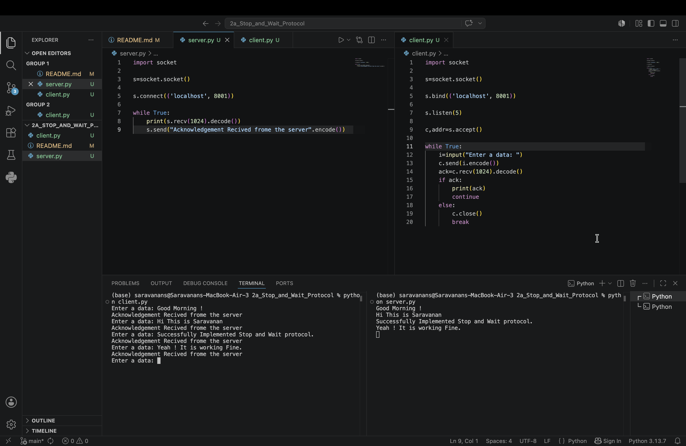
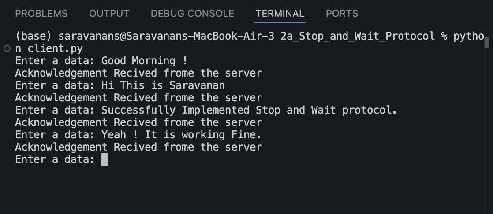
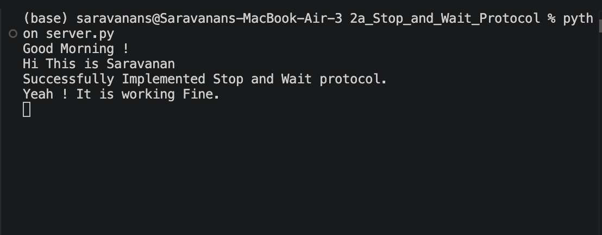

# 2a_Stop_and_Wait_Protocol
## AIM :

To write a python program to perform stop and wait protocol
## ALGORITHM:

1. Start the program.
2. Get the frame size from the user
3. To create the frame based on the user request.
4. To send frames to server from the client side.
5. If your frames reach the server it will send ACK signal to client
6. Stop the Program.

## PROGRAM:

Developed by : **SARAVANAN S**
Reg No : **212225240139**

### Client:

~~~
python
import socket

s=socket.socket()

s.bind(('localhost', 8001))

s.listen(5)

c,addr=s.accept()

while True:
    i=input("Enter a data: ")
    c.send(i.encode())
    ack=c.recv(1024).decode()
    if ack:
        print(ack)
        continue
    else:
        c.close()
        break
~~~

### Server:

~~~
import socket

s=socket.socket()

s.connect(('localhost', 8001))

while True:
    print(s.recv(1024).decode())
    s.send("Acknowledgement Recived frome the server".encode())
~~~

## OUTPUTS:

Refer to the screenshot below to see the program's output.

## OUTPUT:

## CLIENT:

## SERVER:

## RESULT:
Thus, python program to perform stop and wait protocol was successfully executed.
